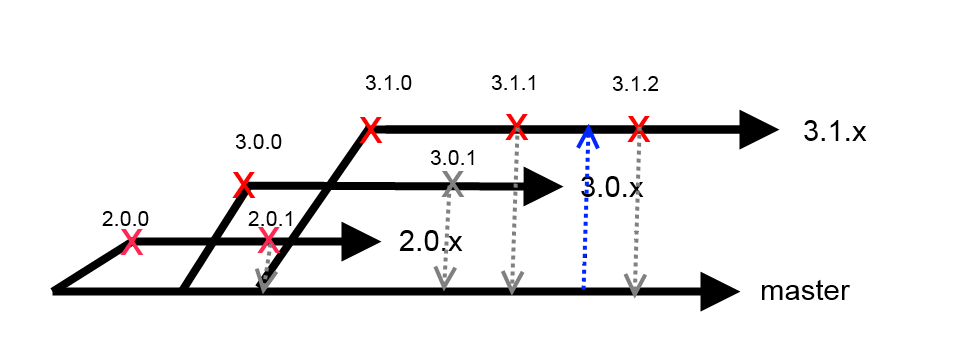

# Liquibase Code Branch Strategy #

Liquibase uses a branching strategy using the following long-lived branches:

* master: Used only as a merge path. Never committed to directly
* next: Corresponds to code that will be released as part of the next major release.
* "#.#.x". Each major release such as "3.1" gets a branch for itself and its patch releases. For example, the 3.1.0 release will be the start of the "3.1.x" branch

Individual features and bug fixes should be developed in their own short-lived feature branches with a pull request to incorporate them into the main repository branches.
For more information on pull requests and GitHub usage, see [contributing to Liquibase](contribute.html).

As part of each release, the releasing branch will be tagged with the actual version number and the changes will be merged into all downstream branches.

### Which branch do I use?

When working on a bug or feature, the code should based off the branch corresponding to the furthest back version family that will include the change.

So if you are ok with the change only going into the next release, branch off "next". If you are using version 3.1.2 and need the change in an upcoming 3.1 release, branch off "3.1.x".

If you have questions, [help is available](../community/index.html).

### Example Workflow

Starting state: there are 3 active branches: "next", "3.0.x", and "3.1.x". 3.0.3 and 3.1.2 are the most recent releases in the previous release families.

Because 3.1 has been released, most development is occurring off the "next" branch. Features are developed in fork branches off "next" and when they are done, pull requests are created and accepted into next.

If a bug is found that needs to be fixed in a 3.1, it is worked on in a branch off 3.1 and when it is done a pull request is created and accepted into the 3.1.x branch.

When we are ready to have a 3.1.3 release, the 3.1.x branch is tagged as "3.1.3" and then merged into "master" and "next".

When we are ready to release the code in "next" and a version number is decided on such as 3.2, the next branch is merged into master for final testing. When all tests pass, a "3.2.x" branch is created and tagged as "3.2.0".

