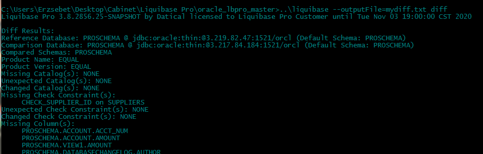
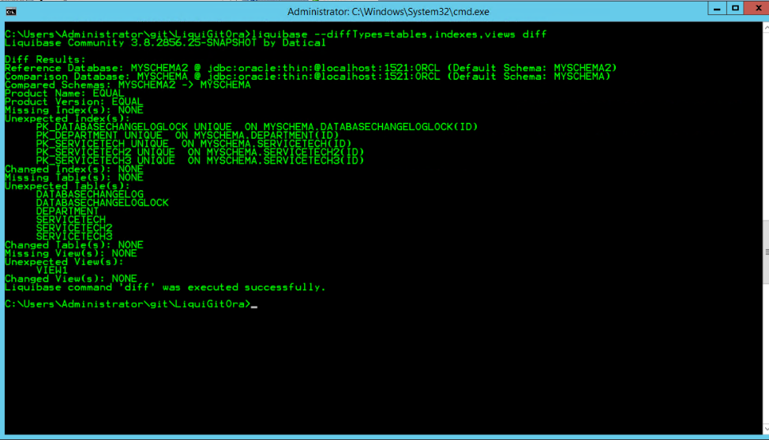

# Liquibase Commands: `diff`
The `diff` command in Liquibase allows you to compare two databases of the same type to one another.

## Uses
The `diff` command is typically used at the completion of a project, because it allows you to verify all expected changes are in the changelog. The `diff` command is also useful for the following tasks:
+ Finding missing objects in your database
+ Seeing that a change was made to your database
+ Finding unexpected items in your database

## Running the `diff` Command
To compare two databases of the same type:
1.	Configure the *liquibase.properties* file to include your driver class path, URL, and user authentication information for both databases.
>**Note:** For information on how to configure your *liquibase.properties* file, view the [Creating & Configuring your *liquibase.properties* File](config_properties.html) topic in the knowledge base.
2.	Save your *liquibase.properties* file.
Note: Instead of using a *liquibase.properties* file, you can also pass the necessary information in the command prompt or Linux terminal.
3.	Open your command prompt or Linux terminal and change the directory to the location of your changelog file, then provide the location of your .bat or .sh file.
>**Note:** If executing the command in the same directory as the .bat or .sh, you only Liquibase is specified. However, if your .bat or .sh is in another directory, pass the path to that location in the command line when you call liquibase.
4.	Run the following command: `liquibase --outputFile=mydiff.txt diff`

## Output

The `diff` command produces a list of categories along with one of the following variables:
+ **Missing:** The object is not on your comparison database (source database).
+ **Unexpected:** There are objects on your comparison database (source database) that are not on your reference database (target database).
+ **Changed:** The object was changed in the database.
> **Note:** The changed variable will not specify the type of change applied to your database. Run the `diffChangeLog` command see specific information about what changes are applied to the database.

Liquibase Community `diff` categories:
+ Catalog
+ Column
+ Foreign Key
+ Index
+ Primary Key
+ Schema
+ Sequence
+ Procedure
+ Unique Constraints
+ View

[comment]: <>  Liquibase Pro `diff` categories:
[comment]: <>  + Check Constraint
[comment]: <>  + Package
[comment]: <>  + Package Body
[comment]: <>  + Function
[comment]: <>  + Trigger
[comment]: <>  + Synonyms
>**Note:** Liquibase does not currently check Datatype length.

## `diff` Command Output Types
Liquibase allows you to create two files:
1.	Diff Report
2.	Diff Changelog

### `diff` Report
A diff report provides a description of the differences between two databases, then reports this information in your command prompt or Linux terminal.

### `diff` Change Log
A diff changelog file contains change sets that allow you to deploy all changes to another database with the update command to sync them.

For more information on how to create a diff changelog, check out the [Liquibase Commands: diffChangeLog](diffchangelog.html) topic in the knowledge base.

## Filtering `diff` Types
Liquibase allows you to use diffType parameters to filter the types of objects you want to compare. Multiple filters can be added to the parameter as a comma separated list.

    Example: `liquibase --diffTypes=tables, indexes, views diff`

Liquibase Community diffType Categories:
+ tables [DEFAULT]
+ columns [DEFAULT]
+ views [DEFAULT]
+ primaryKeys [DEFAULT]
+ indexes [DEFAULT]
+ foreignKeys [DEFAULT]
+ sequences [DEFAULT]
+ data 

[comment]: <> Liquibase Pro diffType categories:
[comment]: <> + Procedures
[comment]: <> + Functions
[comment]: <> + Triggers
[comment]: <> + Package
[comment]: <> + Packagebody

If no diffTypes are specified, the DEFAULT checks are run.

>**Note:** This only works with the `generateChangeLog` and `diff` commands. This does not work with the `diffChangeLog` command.
