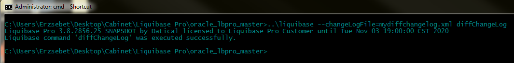
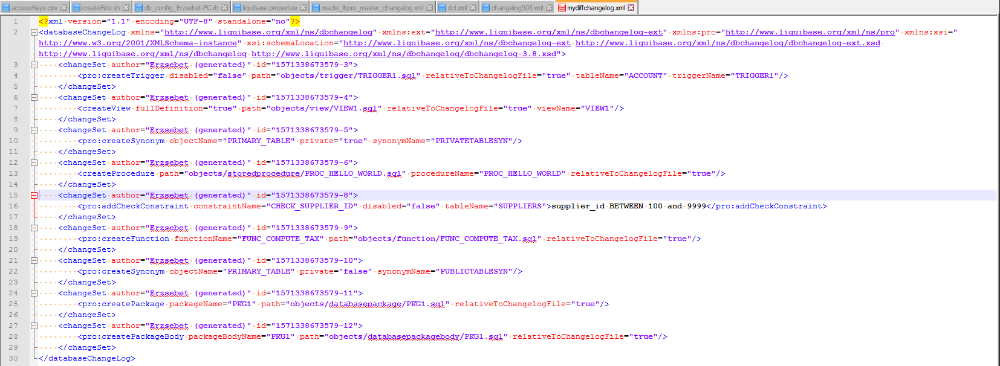

# Liquibase Commands: `diffChangeLog`
The `diffChangeLog` command provides you with:
+ Information regarding differences between two databases.
+ A *changelog* file containing deployable change sets.

## Uses
The `diffChangeLog` command is typically used when you want to create a deployable *changelog* to synchronize multiple databases. The `diffChangeLog` command also provides more information about:
+ Missing objects in your database
+ Changes made to your database
+ Unexpected items in your database

## Running the `diffChangeLog` Command
To create a diff *changelog*:
1.	Configure the *liquibase.properties* file to include your driver class path, URL, and user authentication information for both databases.
> **Note:** For information on how to configure your *liquibase.properties* file, view the [Creating & Configuring your *liquibase.properties* File](config_properties.html) topic in the knowledge base.

2.	Run the following command:  `..\liquibase --changeLoqFile=file_name.xml diffChangeLog`
> **Note:** Replace *file_name.xml*, with your filename and extension format. If you specify a file name that already exists, Liquibase will append your changes to the existing file.

## Output

* The `diffChangeLog` command produces a list of all objects and creates a changelog with a list of changesets.

Liquibase Community `diffChangeLog` categories:
+ Catalog
+ Column
+ Foreign Key
+ Index
+ Primary Key
+ Schema
+ Sequence
+ Procedure
+ Unique Constraints
+ View

Additional Liquibase Pro `diffChangeLog` categories:
+ Check Constraint
+ Package
+ Package Body
+ Function
+ Trigger
+ Synonyms

> **Note:** Liquibase does not currently check datatype length.
