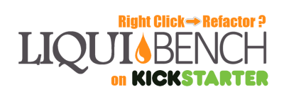

<!--div class="highlight" style="background-color:yellow;padding:10px; margin:20px; text-align:center"><b>WARNING!!!  UNDER CONSTRUCTION. REAL DOCUMENTATION IS AT <a href="http://liquibase.org">http://liquibase.org</a></b></div-->

<h3>Works with your development style</h3>
<ul>
    <li>Supports code branching and merging</li>
    <li>Supports multiple developers</li>
    <li><a href="databases.html">Supports over 15 database types</a></li>
    <li>Supports XML, YAML, JSON, and SQL formats</li>
</ul>

<h3>Powerful refactoring commands</h3>
<ul>
    <li>Simple commands like <a href="documentation/changes/create_table.html">Create Table</a> and <a href="documentation/changes/drop_column.html">Drop Column</a></li>
    <li>Complex commands like <a href="documentation/changes/add_lookup_table.html">Add Lookup Table</a> and <a href="documentation/changes/merge_columns.html">Merge Columns</a></li>
    <li>Plus the ability to <a href="documentation/rollback.html">Generate and manage rollback logic</a></li>
</ul>

<h3>Open and Extensible</h3>
<ul>
    <li>Open Source: Apache 2.0 License</li>
    <li><a href="http://liquibase.org/extensions">Plugin/extensions support</a></li>
    <li>Java Integration APIs</li>
</ul>

<h3>Works with your development processes</h3>
<ul>
    <li>Command Line, Ant, Maven, Spring, and Servlet integrations</li>
    <li>Cluster-safe database upgrades</li>
    <li>Database "<a href="documentation/diff.html">diff's</a>"</li>
    <li><a href="documentation/dbdoc.html">Database change documentation</a></li>
    <li>Automated generation of SQL scripts for DBA code review and approval</li>
</ul>

<h2>Get Started</h2>
<ol>
<li><a href="download/index.html">Download Liquibase</a></li>
<li>Create new changelog file in <a href="documentation/xml_format.html">XML</a>, <a href="documentation/yaml_format.html">YAML</a>, <a href="documentation/json_format.html">JSON</a> or <a href="documentation/sql_format.html">SQL</a>format</li>
<li>Add <a href="documentation/changeset.html">changeset</a> to <a href="documentation/databasechangelog.html">changelog</a> file</li>
<li>Run <a href="documentation/command_line.html">liquibase update</a></li>
<li>Commit changelog file to source control</li>
<li>Repeat</li>
</ol>
<a href="quickstart.html">Quick Start Guide</a> | <a href="documentation/index.html">Full Documentation</a>

<ul>
    <li><a href="#tab-xml">XML Format</a></li>
    <li><a href="#tab-yaml">YAML Format</a></li>
    <li><a href="#tab-json">JSON Format</a></li>
    <li><a href="#tab-sql">SQL Format</a></li>
  </ul>


<?xml version="1.0" encoding="UTF-8"?>

<databaseChangeLog
        xmlns="http://www.liquibase.org/xml/ns/dbchangelog"
        xmlns:xsi="http://www.w3.org/2001/XMLSchema-instance"
        xmlns:ext="http://www.liquibase.org/xml/ns/dbchangelog-ext"
        xsi:schemaLocation="http://www.liquibase.org/xml/ns/dbchangelog http://www.liquibase.org/xml/ns/dbchangelog/dbchangelog-3.0.xsd
        http://www.liquibase.org/xml/ns/dbchangelog-ext http://www.liquibase.org/xml/ns/dbchangelog/dbchangelog-ext.xsd">

    <preConditions>
        <runningAs username="liquibase"/>
    </preConditions>

    <changeSet id="1" author="nvoxland">
        <createTable tableName="person">
            <column name="id" type="int" autoIncrement="true">
                <constraints primaryKey="true" nullable="false"/>
            </column>
            <column name="firstname" type="varchar(50)"/>
            <column name="lastname" type="varchar(50)">
                <constraints nullable="false"/>
            </column>
            <column name="state" type="char(2)"/>
        </createTable>
    </changeSet>

    <changeSet id="2" author="nvoxland">
        <addColumn tableName="person">
            <column name="username" type="varchar(8)"/>
        </addColumn>
    </changeSet>
    <changeSet id="3" author="nvoxland">
        <addLookupTable
            existingTableName="person" existingColumnName="state"
            newTableName="state" newColumnName="id" newColumnDataType="char(2)"/>
    </changeSet>

</databaseChangeLog>




databaseChangeLog:
  - preConditions:
    - runningAs:
        username: liquibase

  - changeSet:
      id: 1
      author: nvoxland
      changes:
        - createTable:
            tableName: person
            columns:
              - column:
                  name: id
                  type: int
                  autoIncrement: true
                  constraints:
                    primaryKey: true
                    nullable: false
              - column:
                  name: firstname
                  type: varchar(50)
              - column:
                  name: lastname
                  type: varchar(50)
                  constraints:
                    nullable: false
              - column:
                  name: state
                  type: char(2)

  - changeSet:
      id: 2
      author: nvoxland
      changes:
        - addColumn:
            tableName: person
            columns:
              - column:
                  name: username
                  type: varchar(8)

  - changeSet:
      id: 3
      author: nvoxland
      changes:
        - addLookupTable:
            existingTableName: person
            existingColumnName:state
            newTableName: state
            newColumnName: id
            newColumnDataType: char(2)




{
    "databaseChangeLog": [
        {
            "preConditions": [
                {
                    "runningAs": {
                        "username": "liquibase"
                    }
                }
            ]
        },

        {
            "changeSet": {
                "id": "1",
                "author": "nvoxland",
                "changes": [
                    {
                        "createTable": {
                            "tableName": "person",
                            "columns": [
                                {
                                    "column": {
                                        "name": "id",
                                        "type": "int",
                                        "autoIncrement": true,
                                        "constraints": {
                                            "primaryKey": true,
                                            "nullable": false
                                        },
                                    }
                                },
                                {
                                    "column": {
                                        "name": "firstname",
                                        "type": "varchar(50)"
                                    }
                                },
                                {
                                    "column": {
                                        "name": "lastname",
                                        "type": "varchar(50)"
                                        "constraints": {
                                            "nullable": false
                                        },
                                    }
                                },
                                {
                                    "column": {
                                        "name": "state",
                                        "type": "char(2)"
                                    }
                                }
                            ]
                        }
                    }
                ]
            }
        },

        {
            "changeSet": {
                "id": "2",
                "author": "nvoxland",
                "changes": [
                    {
                        "addColumn": {
                            "tableName": "person",
                            "columns": [
                                {
                                    "column": {
                                        "name": "username",
                                        "type": "varchar(8)"
                                    }
                                }
                           ]
                        }
                    }
                ]
            }
        },

        {
            "changeSet": {
                "id": "3",
                "author": "nvoxland",
                "changes": [
                    {
                        "addLookupTable": {
                            "tableName": "person",
                            "existingTableName": "person",
                            "existingColumnName":"state",
                            "newTableName": "state",
                            "newColumnName": "id",
                            "newColumnDataType": "char(2)",
                        }
                    }
                ]
            }
        }
    ]
}




--liquibase formatted sql

--changeset nvoxland:1
create table person (
  id int not null primary key,
  firstname varchar(80),
  lastname varchar(80) not null,
  state varchar(2)
);

--changeset nvoxland:2
alter table person add column username varchar(8)



